## Espressif Rainmaker OAuth2 Integration

This project contains the required modules for integration with third party OAuth2 providers.

### What is OAuth2 Integration?

OAuth2 is protocol used for Authorization. OAuth2 app can be integrated with OpenId Connect, allowing it to be used for user authentication. 

You can enable your users who already have accounts with OpenID Connect (OIDC) identity providers (IdPs) (like Github, Salesforce, or Ping Identity) to skip the sign-up step, and sign in to your application using an existing account.

To facilitate Sign-in with third party IDPs, Rainmaker platform provides support for OAuth2 integration with IDPs.

You can configure the required Identity Provider with help of the example given in this repo.

### How does OAuth2 Integration work?
The Oauth2 integration includes API endpoints, which needs to be configured in the AWS account,  where Rainmaker is deployed.
The API endpoints are called by AWS cognito, to sign-in users.

When user clicks on sign-in button on Rainmaker dashboard, AWS Cognito makes call to `esp-Oauth2Authorize` lambda. This lambda in turn makes GET API call to your IDP's authorize API endpoint(specified as env variable Rainmaker_Oauth2_Authorize_URL, espoauth2integration.yml file)
The query parameters that are required to make Authorization successful, are added to URL. In the response of this URL, we get a code and state. 

The application requests authorization to access service resources from the user. If the user authorizes the request, the application receives an authorization grant, which is `code` for grant_type=authorization_code. 

AWS cognito then makes call to `esp-Oauth2Token` lambda, which in turn requests an access token from IDP's token endpoint(specified as env variable Rainmaker_Oauth2_Token_URL), by passing the authorization code along with authentication details, including the client secret, to the API token endpoint. 
In the response,  cognito gets the access_token, which has limited access to user's resources in IDP. Here we have given access to read user's email and email_verified attributes.

Using the access token received with `esp-Oauth2Token` endpoint, cognito fetches user info and passes this info to Rainmaker.

### Deploying and Configuring the OAuth2 Integration consist of following high level steps:
  - [Deploying the SAR repository from the AWS Console](#deploying-rainmaker-oauth2-integration-sar-repository-from-the-aws-console)
  - [Registering an OAuth2 App with the Identity Provider](#registering-an-oauth2-app-with-the-identity-provider)
  - [Configuring the Domain Name in AWS Cognito](#configuring-the-domain-name-in-aws-cognito)
  - [Configuring the IDP in AWS Cognito](#configuring-the-idp-in-aws-cognito)
  - [Configuring the Cognito App Client Settings](#configuring-the-cognito-app-client-settings)

### Deploying Rainmaker OAuth2 Integration SAR repository from the AWS Console
   #### Pre-requisites for starting Rainmaker OAuth2 Integration
   - The ESP Rainmaker should be deployed into your AWS account.
   - Authentication URLs for your IDP like authorize url, token url, userinfo url etc. (optional)
   
   #### Deployment Steps
   1. Login to AWS Management Console.
   2. In the Services, search for SAR (Serverless Application Repository) and click on SAR to navigate to SAR service, as shown below.

   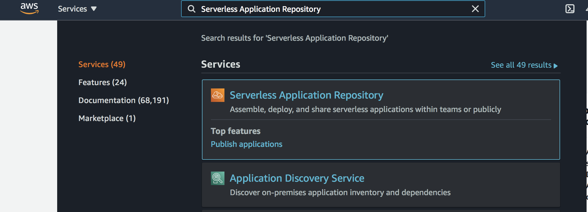
   3. Click on `Available applications` and select `Private applications` tab. Click the checkbox - Show apps that create custom IAM roles or resource policies and search for `espoauth2integration` as shown below:

If you don’t see espoauth2integration repository, please make sure you are in correct region, else contact Rainmaker Support Team. (esp-rainmaker-support@espressif.com)
   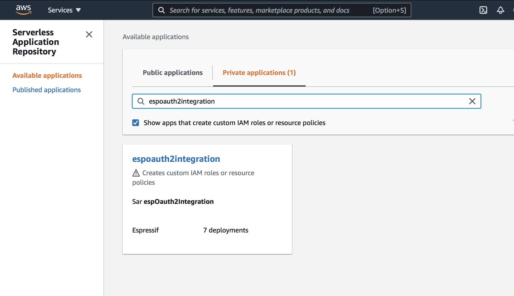
   4. Click on `espoauth2integration` repository.

   5. After clicking on `espoauth2integration` SAR repository, the details for the repository will be displayed as below.

   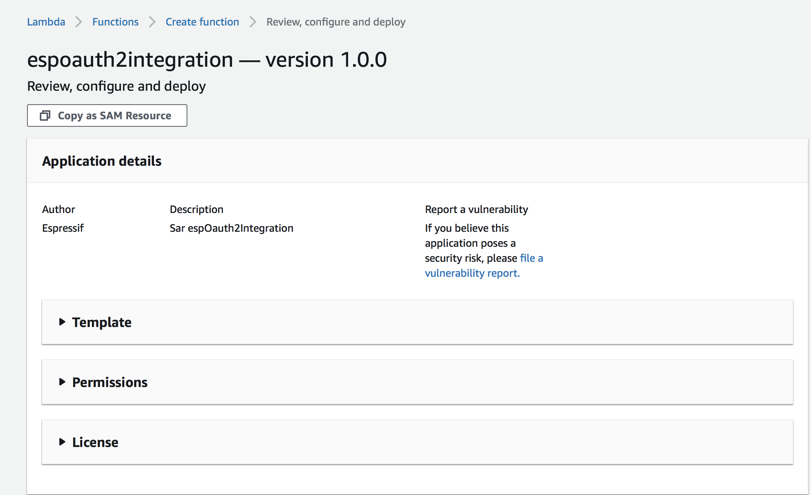
   6. Scroll down and you will see the `Application settings` as shown below.

   7. In the Application settings you have to enter the following URLs
      - RainmakerOauth2AuthorizeUrl : The authorize url for your IDP to authorize user
      - RainmakerOauth2EmailUrl : The email url for your IDP to fetch user email details (optional)
      - RainmakerOauth2TokenUrl : The token url for your IDP to fetch the user authentication tokens
      - RainmakerOauth2UserInfoUrl : The userinfo url for your IDP to fetch the user details

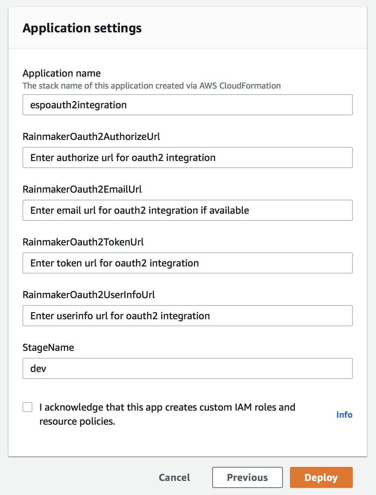

   **Note: If at the time of deploying this OAuth2 integration repository, if you do not have above urls, we can still proceed with the deployment. These URLs can be configured later on, using the configuration APIs provided with this repository.**

   8. Click on the checkbox - “I acknowledge that this app creates custom IAM roles”.
   9. Click on Deploy button, the deployment will start and the below screen will be displayed. The deployment process will be completed in few minutes.
   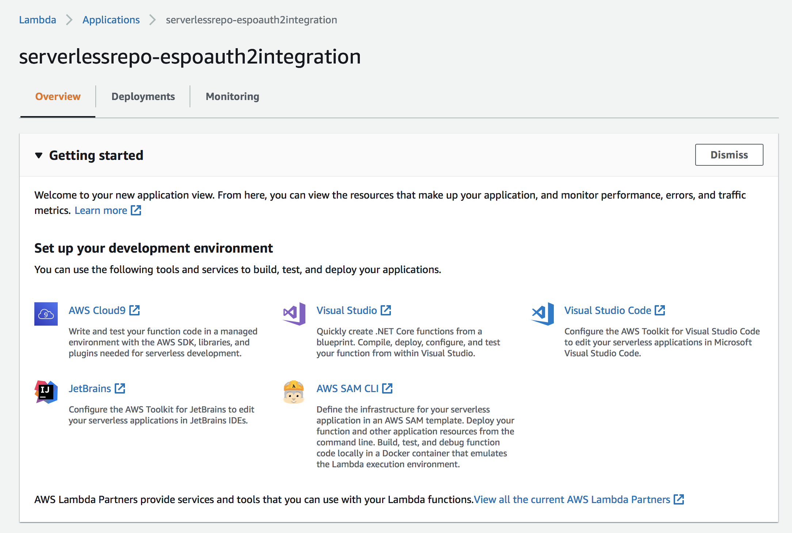

   10. To check the deployment status, click on the `Deployments` tab. After successful deployment, status should look like below.
   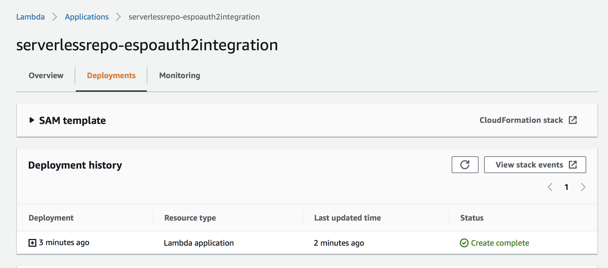

### Registering an OAuth2 App with the Identity Provider

After deployment is successful, the first step is to register an OAuth2 App with the Identity provider, you are going to integrate with. This is generally done on the IDP's developer portal.

While registering the app, you will require the Callback URL during the configuration steps. To get this Callback URL, follow the below steps:
1. Login to AWS Management Console.
2. In the Services, search for Cloudformation and click on it to navigate to Cloudformation console, as shown below.
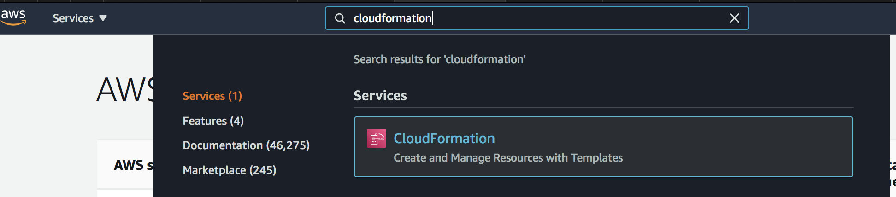
3. Toggle the `view nested` button to disable it and search for `OAuth2`, as shown below.
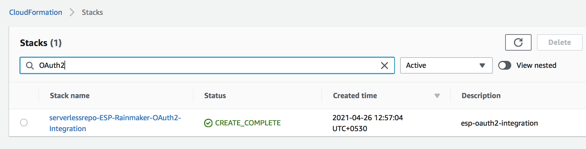
4. Click on `serverlessrepo-ESP-Rainmaker-OAuth2-Integration`.
5. Click on the `Outputs` tab and search for `Oauth2CognitoCallbackURL` as shown below.
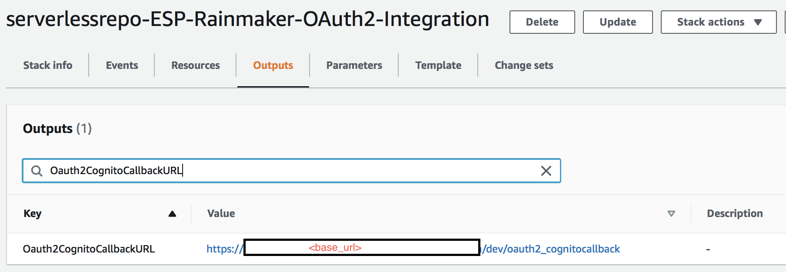
6. In the Outputs section, note down the `Oauth2CognitoCallbackURL` value. This will be used as Callback URL.

Use the above callback url and register your app. After successful registration, you will get ClientId and Client Secret Key. Every IDP provides authentication urls like authorize url, token url, userinfo url etc. You need to note down these urls which are used at the time of deployment. The URLs can be found on the docs provided by the identity providers.

Following is an example link to get Authentication URL, when Salesforce is used as Identity Provider:
- Salesforce - https://help.salesforce.com/articleView?id=sf.remoteaccess_oauth_endpoints.htm&type=5

**Note :** Some IDPs call ClientId as AppId and Client Secret Key as App Secret Key. In this documentaion we are using terms ClientId and Client Secret Key.

### Configuring the Domain Name in AWS Cognito

Steps to configure domain name in ESP Rainmaker Cognito userpool are shown below.
1. Login to AWS Management Console.
2. In the Services, search for Cognito and click on Cognito to navigate to Cognito service, as shown below.
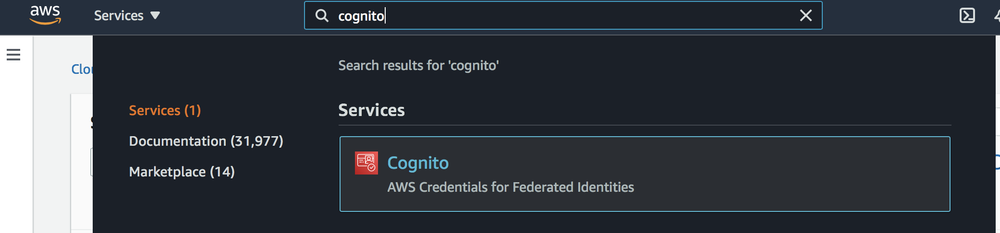
3. On cognito console, click on `Manage User Pools` and select `rainmaker-user-pool` from the available user pools.
4. From the left pane, select `App integration->Domain name` as shown below.

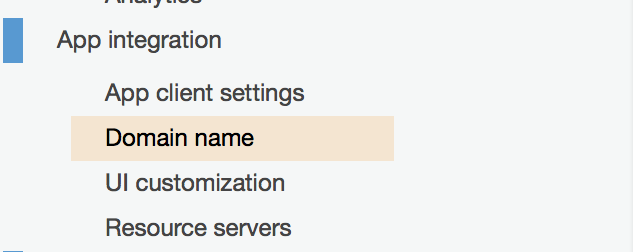

5. Type the domain prefix you want to use in the Domain prefix.
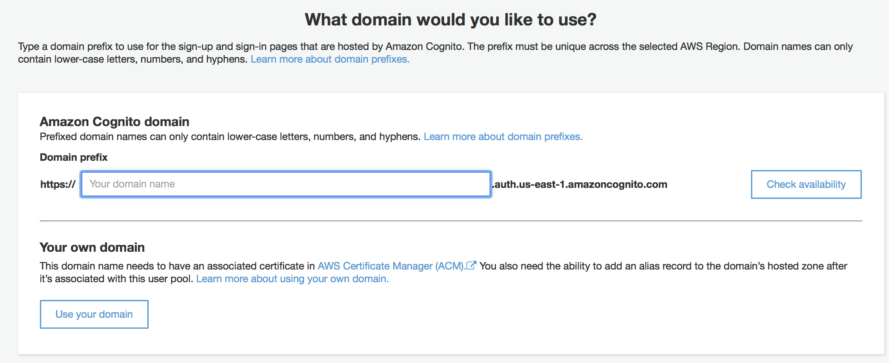

6. Choose Check availability to confirm the domain prefix is available. If domain name is available it will show you the below success message.
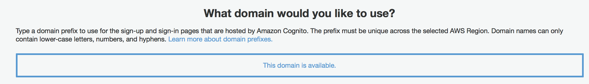

7. Choose save changes.

### Configuring the IDP in AWS Cognito

Steps to configure identity provider details in ESP Rainmaker Cognito userpool are as shown below.
1. Login to AWS Management Console.
2. In the Services, search for Cognito and click on Cognito to navigate to Cognito service, as shown below.

3. On cognito console, click on `Manage User Pools` and select `rainmaker-user-pool` from the available user pools.
4. From the left pane, select `Federaton->Identity providers` as shown below.

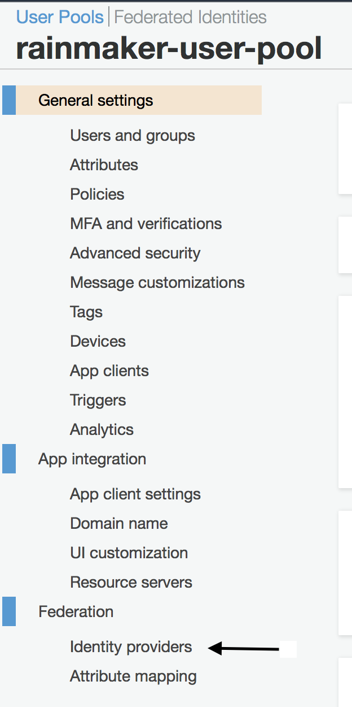

5. On Identity providers page, select `OpenID Connect`, as shown below
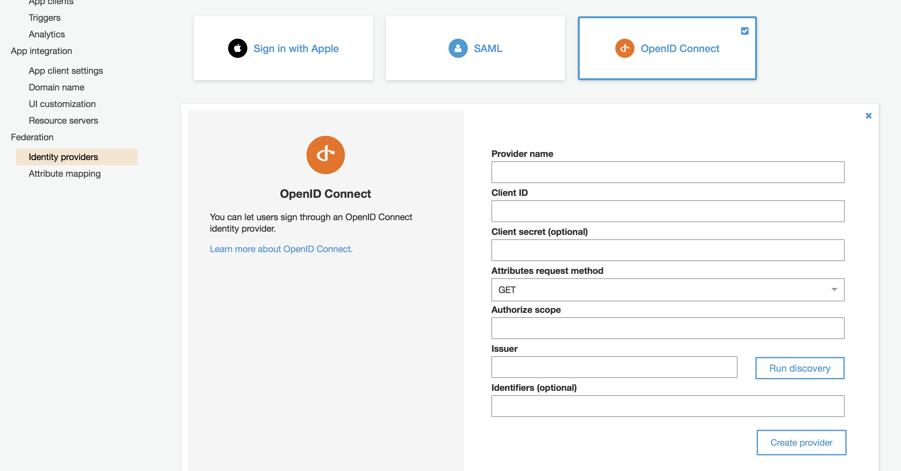
 * 5.1. For Provider name field, add name of your IDP [eg. GitHub, Salesforce, etc]
 * 5.2. For Client ID field, add the Client ID that you have got after registration of your app with IDP.
 * 5.3. For Client secret field, add the Client Secret Key that you have got after registration of your app with IDP.
 * 5.4. For `authorize_scope' field, specify the details that you want to fetch for users at time of sign in. You can check IDP's development docs to get available options for scope.
 * 5.5. For 'issuer' field, enter the endpoint, which you get in output section, while deploying espoauth2integration template. It is the base path of your Rainmaker APIs.
 * 5.6. Click on `Run Discovery` button. If Discovery returned no results, manually add the fields for the endpoints. To get the values for this endpoint go to the output section of espoauth2integration in the cloudfromation console.
   The values for endpoints are as follow:
     * Authorization endpoint - {{Oauth2IssuerApiResource}}/oauth2_authorize
     * Token endpoint - {{Oauth2IssuerApiResource}}/oauth2_token
     * UserInfo endpoint - {{Oauth2IssuerApiResource}}/oauth2_userinfo
     * JWKS endpoint - {{Oauth2IssuerApiResource}}/oauth2_jwks
6. Click on create provider.

 #### Configuring the Cognito App Client Settings
 
1. Login to AWS Management Console.
2. In the Services, search for Cognito and click on Cognito to navigate to Cognito service, as shown below.

3. On cognito console, click on `Manage User Pools` and select `rainmaker-user-pool` from the available user pools. 
4. On cognito console, from left pane click on `App client Settings`.

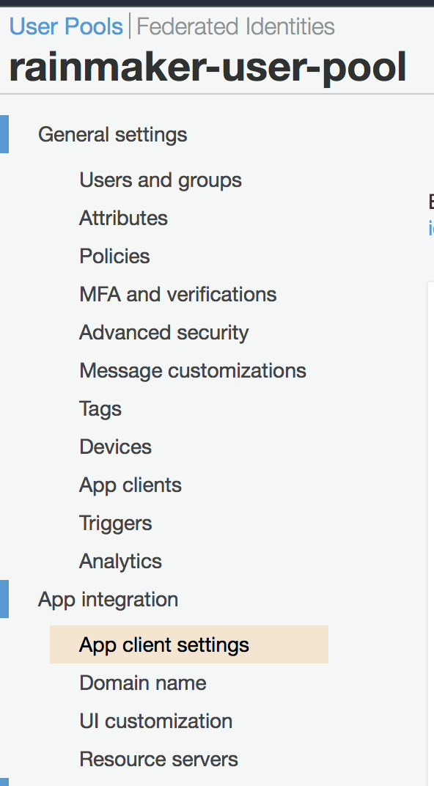

5. Go to App client `rainmaker-user-pool-client` as shown below
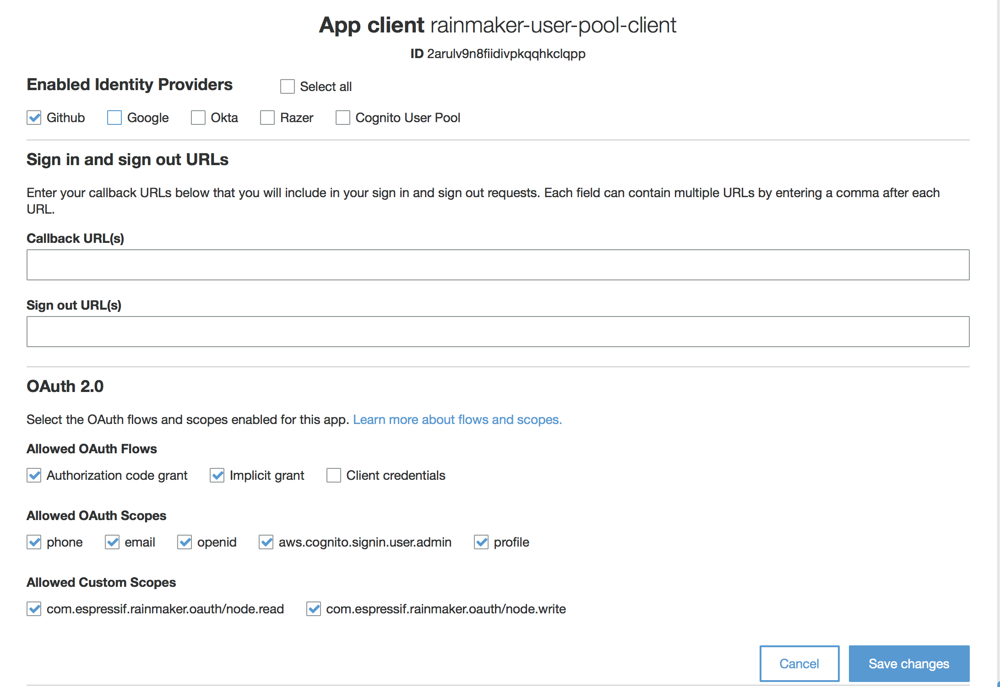
6. In `Enabled Identity Providers` section, select all required IDPs. The Identity Provider which is configured should be selected.
7. In `Callback URL(s)` section enter the callback url where you want to redirect user after successful login.
8. Click on 'save changes' button.

### Steps to verify IDP integration with Rainmaker:

1. Login to AWS Management Console.
2. In the Services, search for Cognito and click on Cognito to navigate to Cognito service, as shown below.

3. On cognito console, click on `Manage User Pools` and select `rainmaker-user-pool` from the available user pools. 
4. On cognito console, from left pane click on `App client Settings`.

5. Go to App client `rainmaker-user-pool-client` and click on `Launch Hosted UI` as shown below.

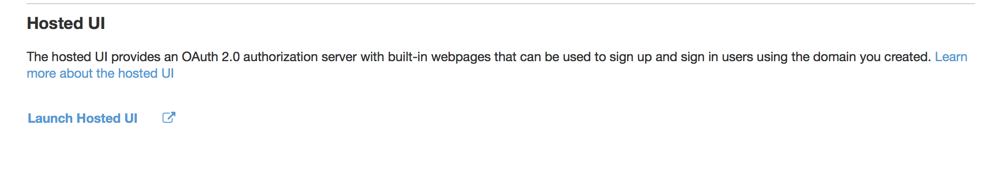

6. You will be redirected to a login window. This window will show you options to login with the IDP that you have configured. For example, if you are using GitHub as the Identity Provider, below login screen will be displayed:

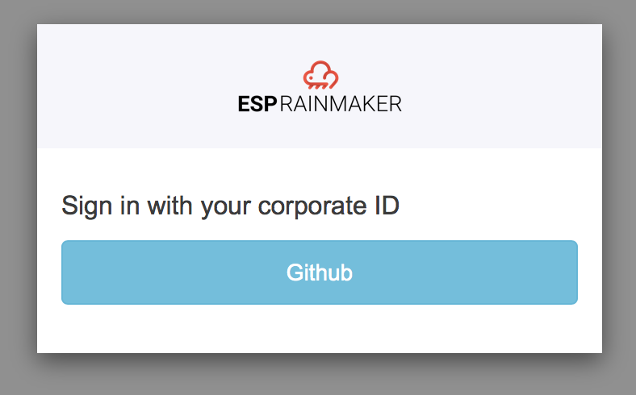

7. Click on GitHub, you will be redirected to GitHub login console. Enter username and password to login.
8. If all the above integrations are correct, login should be successful and you will be redirected to callback url that you have provided in last section.